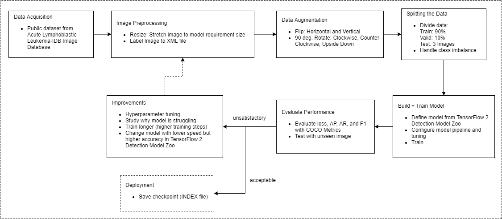
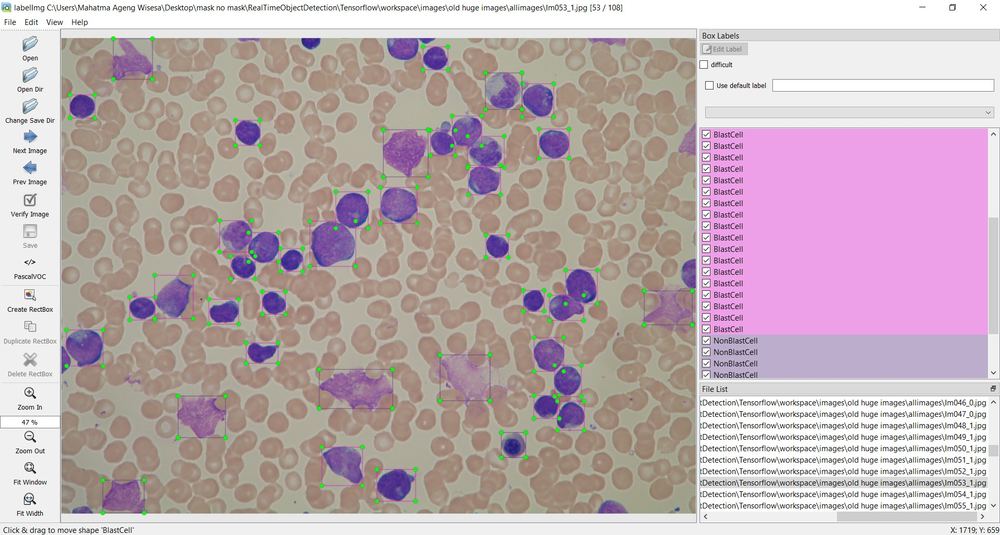
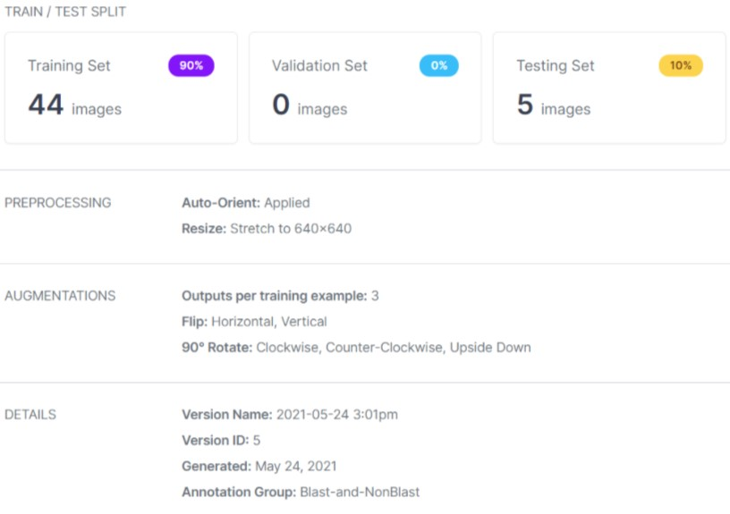
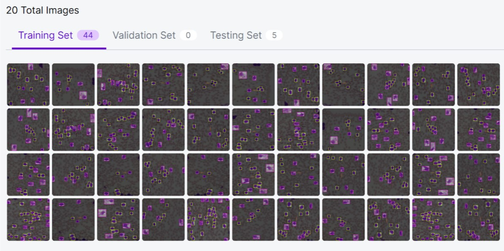

### Machine Learning Workflow:


## 1. Data Acquisition from Acute Lymphoblastic Leukemia Image Database for Image Processing
- Public dataset link: https://homes.di.unimi.it/scotti/all/

## 2. Image Preprocessing
- Labeling Image with LabelImg: https://github.com/tzutalin/labelImg


## 3. Augmentation, Resize and Spliting Data
- Data augmentation and resize using Roboflow: https://roboflow.com/
- Roboflow Train/Test split details (90% train, 10% test):

- New dataset output:


## 4. Build the model that you choosed
- Choose model from TensorFlow 2 Detection Model Zoo: https://github.com/tensorflow/models/blob/master/research/object_detection/g3doc/tf2_detection_zoo.md
- Configure pipeline.config from the model you downloaded
- Read pipeline.config from CONFIG_PATH
```
pipeline_config = pipeline_pb2.TrainEvalPipelineConfig()
with tf.io.gfile.GFile(CONFIG_PATH, "r") as f:                                                                                                                                                                                                                     
     proto_str = f.read()                                                                                                                                                                                                                                          
     text_format.Merge(proto_str, pipeline_config)
```
- Configure pipeline.config as required by the model you choosed (this is just an example that i used)
```
pipeline_config.model.ssd.num_classes = 2
pipeline_config.train_config.batch_size = 4
pipeline_config.train_config.fine_tune_checkpoint = PRETRAINED_MODEL_PATH+'/ssd_resnet50_v1_fpn_640x640_coco17_tpu-8/checkpoint/ckpt-0'
pipeline_config.train_config.fine_tune_checkpoint_type = "detection"
pipeline_config.train_input_reader.label_map_path= ANNOTATION_PATH + '/label_map.pbtxt'
pipeline_config.train_input_reader.tf_record_input_reader.input_path[:] = [ANNOTATION_PATH + '/train.record']
pipeline_config.eval_input_reader[0].label_map_path = ANNOTATION_PATH + '/label_map.pbtxt'
pipeline_config.eval_input_reader[0].tf_record_input_reader.input_path[:] = [ANNOTATION_PATH + '/test.record']
```
- Write back to pipeline.config that you already configured
```
config_text = text_format.MessageToString(pipeline_config)                                                                                                                       with tf.io.gfile.GFile(CONFIG_PATH, "wb") as f:                                                                                                                                     f.write(config_text)
```
